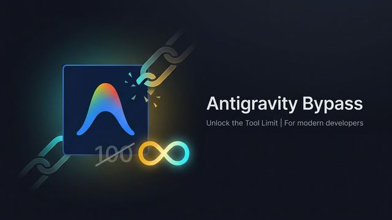

<h1 align="center">Antigravity Bypass</h1>

<p align="center">
  
</p>

---

<p align="center">
  <a href="https://go.dev/"></a>
  <a href="README.md#supported-platforms"></a>
  <a href="LICENSE"></a>
  <a href="https://github.com/Futureppo/antigravity_bypass/releases"></a>
</p>

<p align="center">
  <b>English</b> | <a href="README_zh.md">简体中文</a>
</p>

> MCP tool count limit bypass for Antigravity IDE — auto-adapts to all versions, cross-platform support

Antigravity IDE hard-codes the MCP tool count limit to **100**. This tool removes that restriction with one click. It uses an automatic pattern-search mechanism, so no manual signature updates are needed.

**For the full reverse engineering write-up, see the blog post: [From an Error Message to Two Patches: Reversing the MCP Tool Limit in Antigravity IDE](https://blog.futureppo.top/posts/antigravity/)**

## Disclaimer

This project is for educational and research purposes only. Any consequences of using this tool are the sole responsibility of the user.

## Usage

### Download

Head to [Releases](https://github.com/Futureppo/antigravity_bypass/releases) to download the executable for your platform. Run it and follow the menu to patch or restore.

### Build from Source

```bash
# Clone the repository
git clone https://github.com/Futureppo/antigravity_bypass.git
cd antigravity_bypass

# Build for current platform
go build -ldflags="-s -w" -o antigravity_bypass .

# Cross-compile for other platforms
GOOS=linux   GOARCH=amd64 go build -ldflags="-s -w" -o antigravity_bypass_linux_x64 .
GOOS=darwin  GOARCH=arm64 go build -ldflags="-s -w" -o antigravity_bypass_mac_arm64 .
GOOS=windows GOARCH=amd64 go build -ldflags="-s -w" -o antigravity_bypass_win_x64.exe .
```

### Custom IDE Path

If automatic detection fails, specify the IDE installation directory via an environment variable:

```bash
# The tool will automatically append the resources/app sub-path
ANTIGRAVITY_DIR="/path/to/Antigravity" ./antigravity_bypass
```

> **Fully quit Antigravity IDE** before running.
> Re-run the tool after IDE updates.

## Supported Platforms

| Platform | Architecture | Status   |
| -------- | ------------ | -------- |
| Windows  | x64 / ARM64  | Verified |
| Linux    | x64 / ARM64  | Untested |
| macOS    | x64 / ARM64  | Untested |

If you encounter issues, please open an [Issue](https://github.com/Futureppo/antigravity_bypass/issues) with the relevant logs.

## FAQ

**Q: "File is in use" error?**
> Make sure Antigravity IDE is fully closed (including tray processes), or run the tool with administrator privileges.

**Q: The tool limit came back after an IDE update?**
> This is expected. IDE updates overwrite the patched files. Simply re-run this tool.

**Q: "Tool limit signature not found"?**
> The IDE may have changed its code structure in a new version. Please open an Issue and include your IDE version number.

**Q: How do I restore the original files?**
> The tool automatically creates `.backup` files before patching. Run the tool again and select "Restore all backup files" to revert.

## License

[AGPL-3.0](LICENSE)
