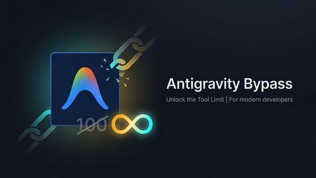

<h1 align="center">Antigravity Bypass</h1>

<p align="center">
  
</p>

---

<p align="center">
  <a href="https://go.dev/"></a>
  <a href="README.md#supported-platforms"></a>
  <a href="LICENSE"></a>
  <a href="https://github.com/Futureppo/antigravity_bypass/releases"></a>
</p>

<p align="center">
  <b>English</b> | <a href="README_zh.md">简体中文</a>
</p>

> Local tool count limit patch for Antigravity IDE 2.5.5 and Windows x64 desktop 2.13.0

Raises recognized local tool count limits to **8192**. IDE **2.5.5** has two **512**-tool checks; the standalone desktop app **2.13.0** has two **800**-tool checks. This tool locates them through the tool-count error string references and control flow. If both checks cannot be identified, it exits without modifying files. Neither version needs a frontend patch.

Supports **Antigravity IDE** and the **Windows x64 standalone Antigravity app 2.13.0**. The CLI and desktop apps for Linux, macOS, and ARM64 are not supported. It changes local checks only; model service limits on tool counts, context, or request sizes still apply.

**For the full reverse engineering write-up, see the blog post: [From an Error Message to Two Patches: Reversing the MCP Tool Limit in Antigravity IDE](https://blog.futureppo.top/posts/antigravity/)**

## Disclaimer

This project is for educational and research purposes only. Any consequences of using this tool are the sole responsibility of the user.

## Usage

### Download

Head to [Releases](https://github.com/Futureppo/antigravity_bypass/releases) to download the executable for your platform. Run it and follow the menu to patch or restore.

Release **v2.1.0** supports IDE only. Desktop support requires a build from the updated source below; the executable must recognize `--client desktop`.

### Build from Source

```bash
# Clone the repository
git clone https://github.com/Futureppo/antigravity_bypass.git
cd antigravity_bypass

# Build for current platform
go build -ldflags="-s -w" -o antigravity_bypass .

# Cross-compile for other platforms
GOOS=linux   GOARCH=amd64 go build -ldflags="-s -w" -o antigravity_bypass_linux_x64 .
GOOS=darwin  GOARCH=arm64 go build -ldflags="-s -w" -o antigravity_bypass_mac_arm64 .
GOOS=windows GOARCH=amd64 go build -ldflags="-s -w" -o antigravity_bypass_win_x64.exe .
```

### Custom Installation Path

If automatic detection fails, specify the installation directory via `--dir` or `ANTIGRAVITY_DIR`:

```bash
# IDE: installation root, resources/app directory, or macOS .app path
# Windows desktop: installation root or resources directory
ANTIGRAVITY_DIR="/path/to/Antigravity IDE" ./antigravity_bypass
```

> **Fully quit the selected Antigravity client** before patching or restoring.
> After client updates, run `--check` again before patching.

### Command-line mode

```powershell
.\antigravity_bypass.exe --client ide --check --dir "C:\Apps\Antigravity IDE"
.\antigravity_bypass.exe --client ide --patch --dir "C:\Apps\Antigravity IDE"
.\antigravity_bypass.exe --client ide --restore --dir "C:\Apps\Antigravity IDE"
```

For the Windows x64 desktop app **2.13.0**:

```powershell
.\antigravity_bypass.exe --client desktop --check --dir "C:\Apps\Antigravity"
.\antigravity_bypass.exe --client desktop --patch --dir "C:\Apps\Antigravity"
.\antigravity_bypass.exe --client desktop --restore --dir "C:\Apps\Antigravity"
```

Omit `--dir` to use automatic discovery. Without an action flag, the interactive menu is displayed. `--client` defaults to `auto`; when both IDE and desktop are discovered, select one with `--client ide`, `--client desktop`, or an explicit path. `--dir` overrides `ANTIGRAVITY_DIR`; an invalid or mismatched explicit path fails without falling back to another installation. Both the new `Antigravity IDE` and legacy `Antigravity` installation names are detected.

The desktop patch changes only `resources/bin/language_server.exe`. It reads `app.asar` to validate the product, version, and launcher, and leaves the archive and Electron executable unchanged. Desktop versions other than **2.13.0** are rejected until verified.

## Supported Platforms

| Platform | Architecture | IDE 2.5.5 verification |
| --- | --- | --- |
| Windows | x64 | Official package: inspection, patch, repeated execution, and restore verified |
| Linux | x64 | Official package: inspection, patch, repeated execution, and restore verified |
| macOS | x64 | Mach-O parsing implemented; package and runtime not verified |
| Windows / Linux / macOS | ARM64 | Binary patching unsupported; fails explicitly without applying x64 instructions |

Verification uses extracted package files and byte comparisons; signed-in IDE/model calls have not been tested. See the [2.5.5 compatibility notes](docs/compatibility-2.5.5.md) for sources, hashes, and patch sites. Legacy frontend constants of 100 / 114514 are recognized, but older backends must meet the new complete matching requirements. Compatibility with every historical release is not guaranteed.

| Standalone desktop | Architecture | 2.13.0 verification |
| --- | --- | --- |
| Windows | x64 | Official package: inspection, patch, repeat, exact restore, backend startup, and local frontend HTTP verified |
| Linux / macOS | All | Not supported |
| Windows | ARM64 | Not supported |

Desktop verification used an isolated profile without signing in. Real model requests and tool calls have not been tested. See the [desktop 2.13.0 compatibility notes](docs/compatibility-desktop-2.13.0.md). Antigravity CLI is outside the current support scope.

If you encounter issues, please open an [Issue](https://github.com/Futureppo/antigravity_bypass/issues) with the relevant logs.

## FAQ

**Q: "File is in use" error?**
> Make sure the selected Antigravity client is fully closed (including tray processes), or run the tool with administrator privileges.

**Q: The tool limit came back after a client update?**
> Updates overwrite patched files. Run `--check` first. If old backups do not match the new files, move the old `.backup` and `.backup.json` files elsewhere before patching again. Do not restore an older binary over an updated client. Desktop versions other than 2.13.0 require a compatibility update.

**Q: "Tool limit signature not found"?**
> The code structure may differ. Include the `--check` output, client type, version, OS, and architecture in an Issue. IDE 2.5.5 and desktop 2.13.0 needing no frontend patch is expected.

**Q: How do I restore the original files?**
> Patching creates `.backup` files and `.backup.json` checksum records. Select "Restore backups" or use `--restore` with the same client/path. Files are restored only when their checksums match the recorded state; both backup files are then removed. Older backups without checksum records require manual restoration after confirming the client version.

**Q: Already used the old patcher on 2.5.5?**
> The old signature can match unrelated string-processing instructions. Restore matching original files or reinstall the official 2.5.5 package before using this version.

## License

[AGPL-3.0](LICENSE)
